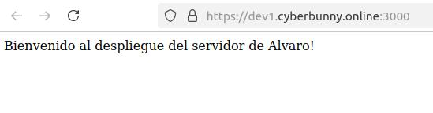

# Despliegue HTTPS

En esta práctica vamos a desplegar un servidor web básico y nos aseguramos de configurar una conexión segura HTTPS.

## Crear un servidor web básico

El servidor tendrá dos endpoints:

- `GET /` que devolverá un mensaje de bienvenida.
- `GET /messages` este endpoint devolverá los mensajes almacenados en la base de datos.
- `POST /messages` este endpoint permitirá añadir un mensaje a la base de datos.

Ambos endpoints `GET /messages` y `POST /messages` esperan una `APIKEY` en la cabecera de la petición. Si la `APIKEY` no es correcta, el servidor delvolverá un error `401 Unauthorized`.

La `APIKEY` inicialmente irá hardcodeada en el servidor.

## Despliegue HTTP

Una vez tengas la aplicación funcionando, conectate a tu VPS, clona el repositorio y despliega la aplicación.

### Pasos

1. Abrir la teminal y introducir lo siguiente:
```bash
ssh root@172.233.120.218
```

2. Actualizar
```bash
sudo apt update
```

3. Clonar el repositorio
```bash
git clone
```

4. Instalar dependencias
```bash
npm install
```

5. Iniciar servidor
```bash
npm run start
```

6. Comprobar que se ha iniciado correctamente:
`http://dev1.cyberbunny.online:3000/`

### Pasos para despliegue HTTPS

1. En nuestra terminal iniciamos el archivo llamado `deploy.sh`.

2. Dentro tendremos que mover los certificados a la raiz de la carpeta del proyecto
```bash
ls
mv message/* .
```

3. En nuestro `index.js` tendremos que tener la ruta específica:
```js
    key: fs.readFileSync(path.join(__dirname, 'privkey.pem')),
    cert: fs.readFileSync(path.join(__dirname, 'fullchain.pem'))
```

4. Por último inicia tu servidor
```bash
npm run start
```
Captura para verificar que tenemos https en nuestra web:


